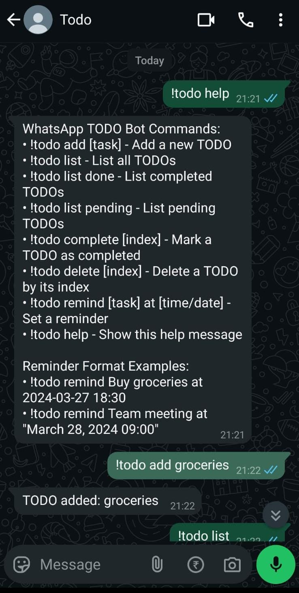
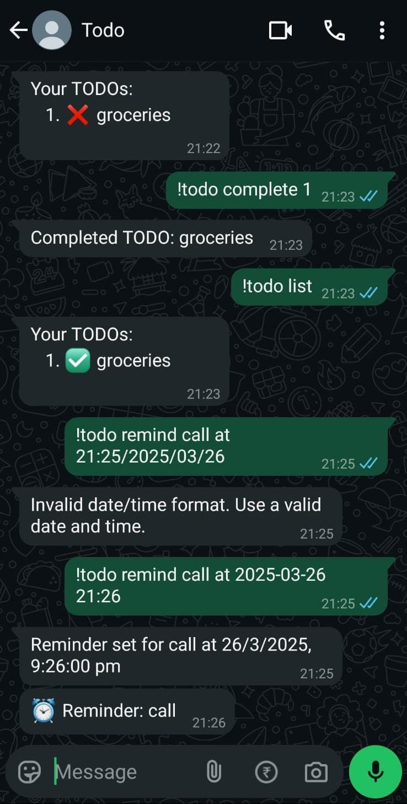

# WhatsApp TODO Bot

A simple WhatsApp bot that helps you manage your to-do list and set reminders directly from WhatsApp using the `whatsapp-web.js` library.

## Features

- 📌 Add new TODO items
- 📋 List all, completed, or pending TODOs
- ✅ Mark TODOs as complete
- ❌ Delete TODOs
- ⏰ Set reminders for specific tasks
- 🆘 Interactive help command

## Prerequisites

Before running the bot, ensure you have the following installed:

- [Node.js](https://nodejs.org/en/download/) (v14 or later)
- A WhatsApp Web account linked to your phone

## Demo 

